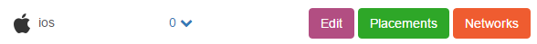
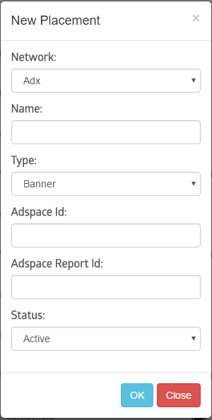
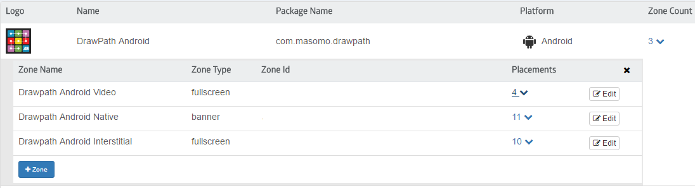
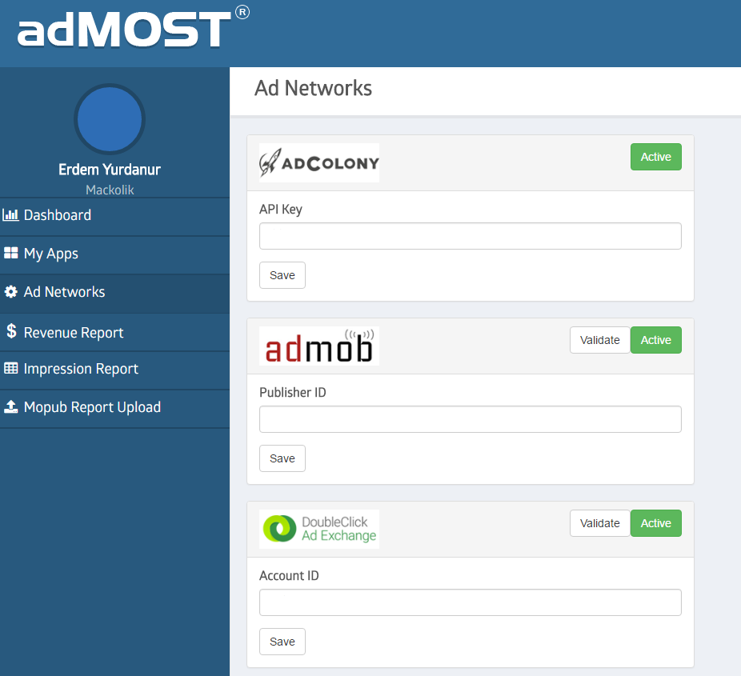
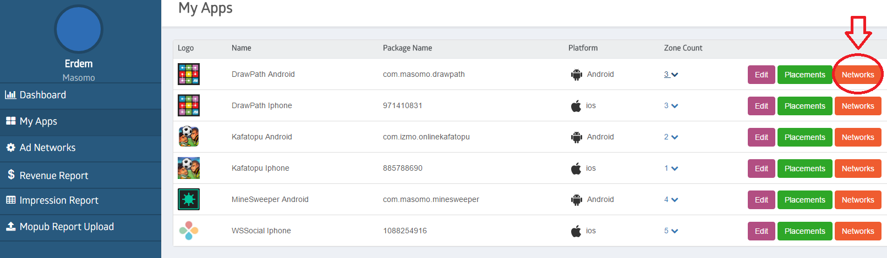
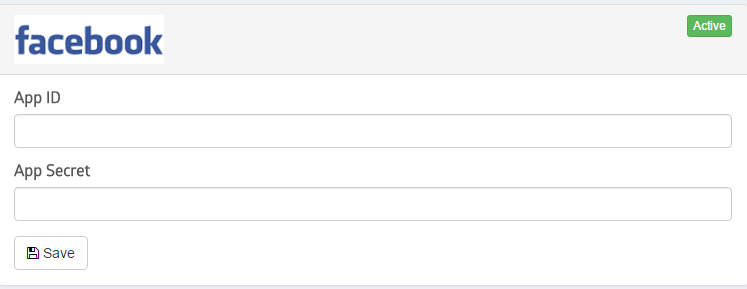
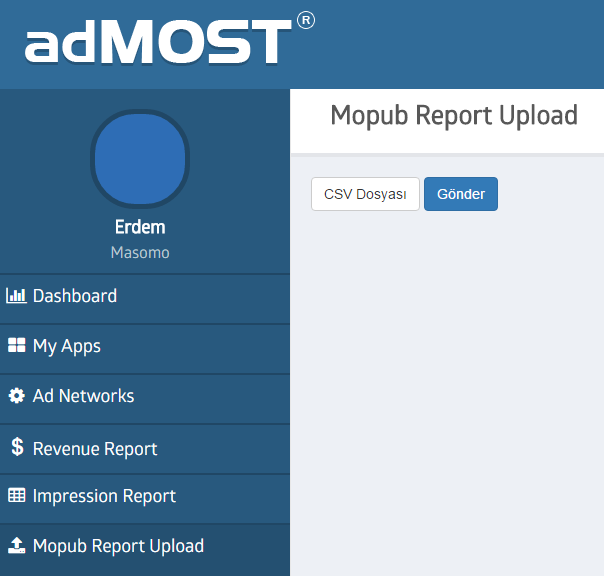

## AMR Dashboard

First navigate to the "My Apps" section from the left menu and create your application. After you complete this step, a record of your app will be added to the list below.  



**Networks :** 

Next step is to enable the ad networks for your app. By default all networks are disabled for a new app. When you click on Networks button you will see the list of available networks. Using the "Activate" button activate the networks you would like to use in your app. Please keep in mind the more networks are activated for your app, the better ecpm optimization the system can provide you. 

You can leave the credentials empty at this point, since a more detailed explanation is available for ad network credentials at a later stage.

**Placements :** Placement is a representation of an ad unit created at an ad network that will be used to show banners or interstitials. Every ad unit of ad network has to be mapped to a placement in our system. 

## Ad Units Definitions For Ad Networks

Create the necessary ad units on related ad networks for your zone types. We recommend that you create all ad units for the networks you activated above. 

### Banners (320x50, 300x250)

```sh
ADMOB
Banner
Native

ADX
Banner
Native

FACEBOOK
Banner
Native

AMAZON
Banner

FLURRY
Banner
Native (Stream, Detailed Card)

MOPUB
Banner
* Banner 250 if needed (Mopub are serving only one size per adunit, so if you will use the size of 250px on your app, you have to define it on mopub dashboard.)
Native (Custom Layout)

MOBFOX
Banner

INMOBI
Banner
Native (Content Stream have to be selected)

AMAZON
Banner (Application Key)

ADFALCON
Banner

LOOPME
Banner
```

### Interstitials
```sh
ADMOB
Interstitial
Native Interstitial

ADX
Interstitial - Fullscreen
Native Interstitial - Fullscreen

FACEBOOK
Interstitial

AMAZON
Interstitial

FLURRY
Interstitial
Native Interstitial (Stream, Detailed Card)

MOPUB
Interstitial
Native Interstitial (Custom Layout)

MOBFOX
Interstitial

INMOBI
Interstitial
Native Interstitial (Content Stream have to be selected)

ADFALCON
Interstitial

LOOPME
Interstitial

SUPERSONIC
Interstitial

NATIVEX
Interstitial

APPLOVIN
Interstitial
```

### Videos
```sh
LOOPME
Video (Phone Video FullScreen)

ADCOLONY
Video

VUNGLE
Video

CHARTBOOST
Video

APPLOVIN
Video

NATIVEX
Video

SUPERSONIC
Video

MEDIABRIX
Video
```

## AMR Placement Definition

Every ad unit of ad network has to be mapped to a placement in our system. Use "Placements" button to add or edit a placement for an application in AMR dashboard “My Apps” page.

New placement pop-up is like below;



There are two critical fields in this pop-up.

* **Adspace Id**: This value will be used to request banners by the sdk. Every ad network gives you this value just after the ad space is created. You can enter this value here.

* **Adspace Report Id**: This value will be used to get reports from ad networks which is then used to optimize your revenue.The way of getting this value depends on the ad network.

>Admob : Last part of the Adspace Id after "/" character.  
>Example: ca-app-pub-329764543589511112/**243370934484**

>Adx : Last part of the Adspace Id after "/" character.  
>Example: ca-mb-app-pub-47743342424239440310/**928913422228**

>Adcolony : Last part of the url of your zone detail.   
>Example: https://clients.adcolony.com/zones/74567

>Facebook : Last part of the Adspace Id after "_" character.  
>Example: 619292656345822__**623324358661137271**

>Chartboost : Campaign id

>Flurry : In your gemini account reporting tab, you will see ad units you created on flurry dashboard. Reporting id is the value after the section part from the ad unit report url.  
>Example: https://gemini.yahoo.com/publisher/1030048/reporting/property/59590/section/5489491/adunit/92230  
If you don’t have a gemini account, please ask account consultant for it.

>Mopub : When you click on your app name on inventory page of mopub dashboard, you will see the list of ad units. AdSpace Report Id of an ad unit is concatenation of the name of the app, a space character and the name of the ad unit.  
>Example: Clash Of Clans FullScreen Ad.

>Inmobi : Same as the adspace id.

>Vungle : Same as the adspace id.

>Loopme : Same as the adspace id.

>Mobfox : Inventory Id of the ad unit.

>Amazon : No reporting api yet. You don’t have to enter this value.

>Adfalcon : No reporting api yet. You don’t have to enter this value.

>Applovin : Comma separated app name, platform, ad type and ad size. Available ad type and ad size values are as follows;  
>graphic,inter (for interstitials)  
>reward,inter (for rewarded videos)  
>Example Report Id : clash royal,android,graphic,inter

>Nativex : AdSpace Id is Placement Name. AdSpace Report Id is concatenation of App Id, a hypen and placement name.
>Example Report Id : 36800-Main Menu Screen Single Ad

>Supersonic : Same as the adspace id. (Application Key)

>MediaBrix : Same as the adspace id. (App Id)

## AMR Zone

Zone is group of placements which is used to show banner or interstitial in your app. You have to create different zones for each ad types. If you will show interstitial and banner ads in your app, you have to create at least one zone for interstitials and one zone for banners. It is possible to create extra zones for one ad type to use different combinations of ad networks but it will not be a recommended usage for ecpm optimization.



When you click on Zone Count of an app line on "My Apps" page, you will see the list of zones for your app. You can add zones and placements to your zones in this section. Zone Id is a critical info and will be used in sdk integration.

There are two types of zones;

* Banner : Any size of display ads and native ads.
* FullScreen : Can be used for interstitial or video ads.

## Report Api Setup

For each network you’ll have to enter identifiers on the following page of AMR panel. This page is used for publisher level ad network definitions.



Explanations about the needed identifiers per ad network are as follows.

**AdColony**  
API Key ( Account Setting - Read Only API Key)

**Admob**  
Publisher Id  
Validation required  

**Adx**  
Account Id  
Validation required  

**ChartBoost**  
User ID  
User Signature  

**Facebook**  
Facebook requires application level authentication, so you have to enter your App ID and  App Secret for your each application. You can reach out your applications Network setting page from the "My Apps" page of AMR.



**Flurry**  
Publisher ID  

**Inmobi**  
User Name  
Password  
Account Id  
Secret Key (You have to ask your Inmobi consultant for your Report API secret key)  

**MobFox**  
Api Key  

**Mopub**  
Mopub don’t have a reporting api yet. You can upload your reports taken from the Mopub panels using Mopub Report Upload Page.


**Vungle**  
Api Key  
